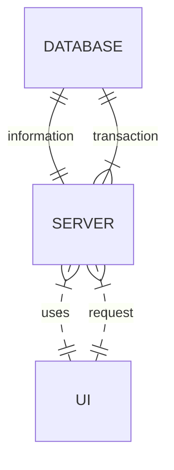
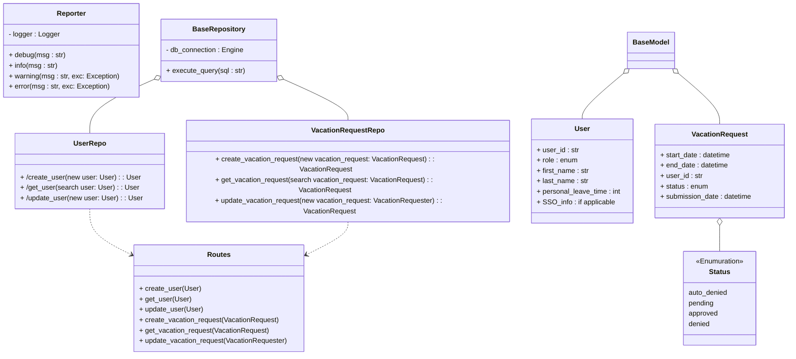
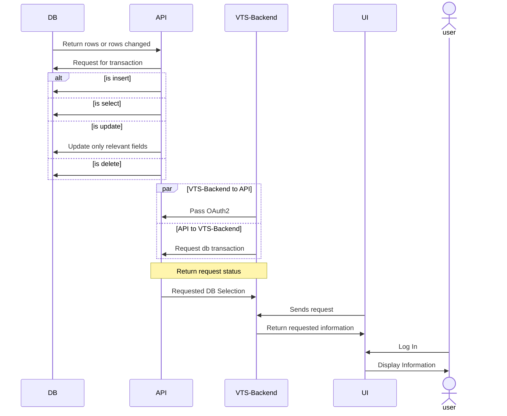
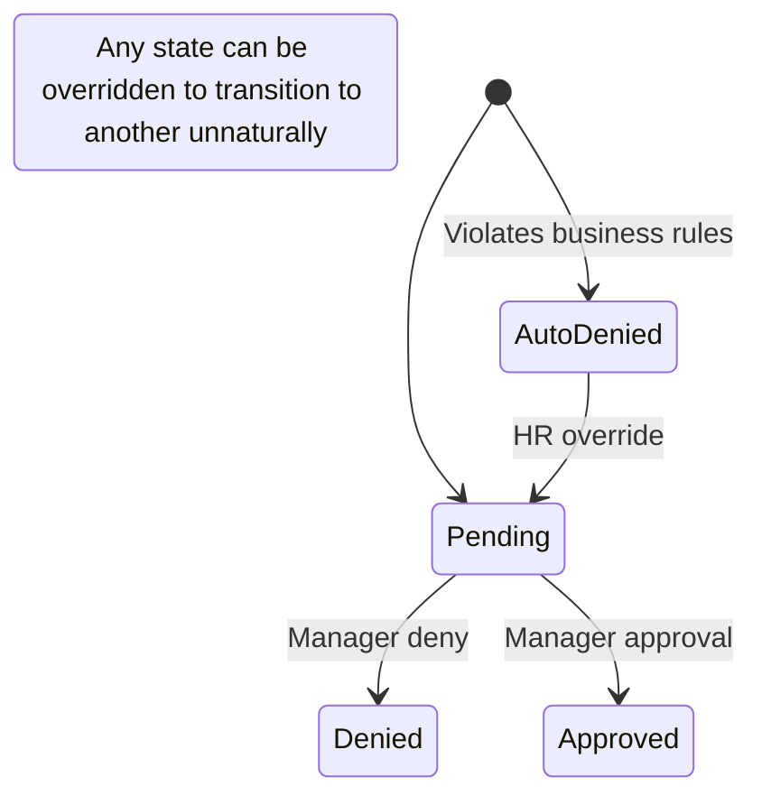
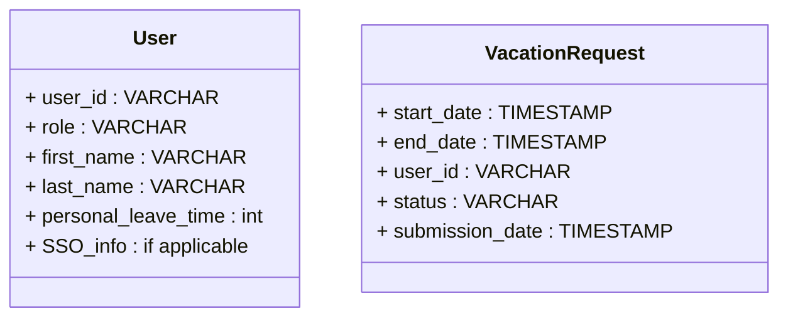

# Major Components
## Database
There needs to be a source of truth to record and verify vacation related requests, in pair with the api - all levels of users will indirectly interact with the database to update and view vacation time, sick leave, and personal time off.
## Server
Database transactions are sensitive and need also to be web connective. Using an API as the middleman between the database and any frontend allows for flexability in our frontend (can be anything that can send a request) and sanitizes the database transactions from possible malcious attacks. Business logic also will live in the api and reject requests that do not fit company policy or the local facility’s leave policies. 
## VTS-Backend and UI
The backend and the user interface, UI have been abstracted into two parts to show a common design pattern, but can be thought of as one entity. Users will use the UI to interact with the VTS-Backend, and the VTS-Backend will send requests to the API to interact with the database. 

# Archtectural Style
This is a client-server model, where the api speaks to a database. Client-server was chosen because a database is necessary to maintain the state of employees' vacation time and a server handles database transactions so untrained users can access the information without being trained in databases, which fits the requirement of the system must be easy to use. Using a server seperates the business logic from the UI, which allows for potentially multiple UI's with a single point of maintenance. This obfuscation of the logic also allows for users to not need knowledge of the inner workings of the database and rules. They can simply recieve error messages for when requests that do not fit company policy or the local facility’s leave policies.
## Evaluation of major design issues
### Reliability
The online portion of the system should be reliable with multiple instances of the server running in the cloud. This way, in the case of an instance going offline - the DNS resolver should redirect traffic to another online instance. The database will have replica's subscribing to transactions happening to it, in case of catestrophic DB failure.
### Reusability
Because the logic is contained in the server, any UI redesign or additional platform support would be possible for anything that can send a request over the internet.
### Maintainability
Additionally the logic being contained in the api (the api is what is running on the server) allows for a single point of logic maintenance. This seperation from the UI frontend allows for simple decoupling where changes to the UI need only conform to the API's endpoints. Changes to the API should be done carefully and consciously as the UI is expecting data in a format from certian endpoints.
### Testability
All expected behaviors are easily testable in containerized setups, a database can be built for each test run and the expected logic can be tested by simulating hit endpoints with dummy data. Because all of the logic lives in one place, it can be tested directly without any black box implications.
### Performance
Potential performance bottlenecks within the system lie in database transaction locks from multiple requests being processed by the server. However because of the usecase there should be no expensive transactions on the database that will cause locks for more than a few milliseconds. Additionally on average the request times from the API to database should be in the same range of a few milliseconds, causing any latency felt by the user to rest on their own internet connection and performance of the UI on their device.
### Portability
The API and DB will be containerized so they will run on any device that accepts containers like through Docker. The UI will be tailored to the company hardware that employees will be using, and because of the seperation of logic - the logic will be extremely portable across different platforms allowing for wide support.
### Security
Users will have profiles stored in the database and they will send a login request that will be verified by the API interacting with the database.
### Safety
Login requests by users will use hashed passwords and passwords will be stored in the database. Additionally the API will only accept and send information using HTTPS, an encryption protocol.

# Requirement Validation
### Implements a flexible rules-based system for validating and verifying leave time requests 
Users will be able to submit any time request, this time request will hit the API and the API will validate that this request is possible. If necessary, the API will look at relevant data pertaining to this request from the database. When a request is found as invalid, an error will be sent back to the UI and the reasoning for request failure will be communicated to the user. Additionally, successful requests will also be sent back to the user. The UI should be able to display all active pending and approved requests for that user to the user.
### Enables manager approval (optional) 
By adding a pending state to time off requests, the API can notify manager users that there are requests waiting approval. When that manager views and sends an approval or denail request, that time off request will change status to denied or approved.
### Provides access to requests for the previous calendar year, and allows requests to be made up to a year and a half in the future 
Requests will be stored indefinately in the database. A cron job attached to the API could clear out rows older than a year if required but shouldn't be necessary. The API will reject requests farther than a year and a half in advance.
### Uses e-mail notification to request manager approval and notify employees of request status changes 
Email will be a stored value of a user. When a time off request is recieved the API will send an email in addition to adding a pending request to the database. The request to deny and approve requests by managers will follow a similar logic and also send an email to the employees, using their stored email.
### Uses existing hardware and middleware 
Existing hardware will need to be capable of running docker images, have connection to the intranet, and accept connections from within the intranet.
### Is implemented as an extension to the existing intranet portal system, and uses the portal’s single-sign-on mechanisms for all authentication 
Requests will only be accepted from inside the intranet, and that contain related keys from the sso.
### Keeps activity logs for all transactions 
All requests will be hooked into a logger that sends transactions to a listener somewhere in the intranet that records that emited information.
### Enables the HR and system administration personnel to override all actions restricted by rules, with logging of those overrides
Failed requests due to buisness rules should still be entered into the system with a status indicating that it was a rule related failure. There should be an endpoint to change the status of this request to either pending (still require manager approval) or move it to approved. Changing these statuses through the api allows for the logging method mentioned previously to be used.
### Allows managers to directly award personal leave time (with system-set limits) 
Personal leave time will be a field tracked on a user, there will be an endpoint to allow a manager to increment this number.
### Provides a Web service interface for other internal systems to query any given employee’s vacation request summary 
An endpoint that returns a vacation request summary given a user identifier. This API endpoint should qualify as a web service interface.
### Interfaces with the HR department legacy systems to retrieve required employee information and changes
How this information is stored would greately change the approach to retrieving this information and changes. If the information is stored in a single place of accessable truth it could possibly be automated by pulling that information intermittenly with a cron job like the potential row deletion job. If it already exists in a database, the API could be given access to that DB as well. At worst an endpoint can be exposed that accepts a csv if it is stored in excel and updates the relevant rows in this service's DB.

# Lower level architecture
## UML Class Diagrams

## UML Activity Diagrams

## UML Message Sequence Diagrams  

## UML Statechart Diagrams

## Database Design

## User Interface Design

